# 向量
线性代数中最基础的、最根源的组成部分就是向量，所以我们得在什么是“向量”上面达成共识。
## 什么是向量？

向量的解释分为三个学科————数学、物理学、计算机科学

在物理学中，向量被认为是一个空间中的箭头，决定一个向量的是它的长度和所指的方向。在一个平面中向量是二维的，在空间中向量是三维的

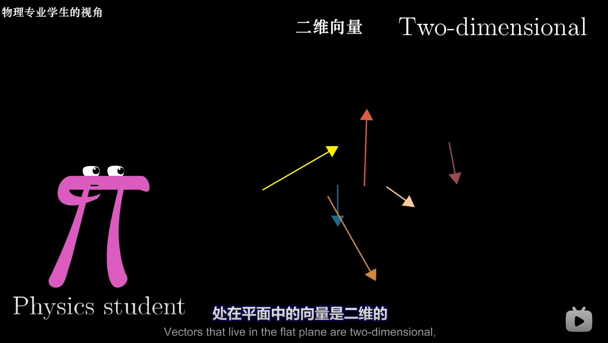

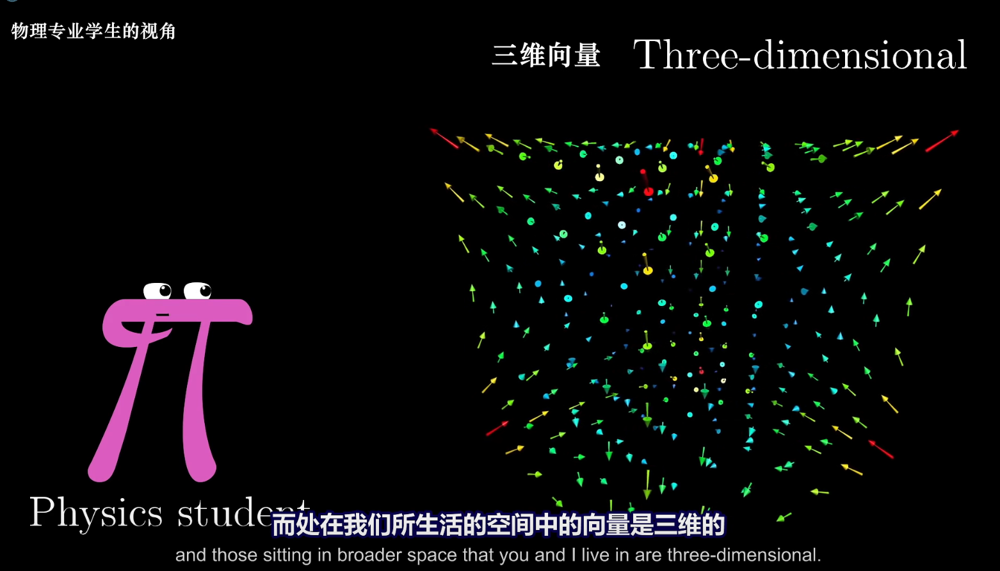

计算机学中的*向量*是**有序的数字序列**。举个例子，当你对房价进行分析的时候，你需要关注两个特征：房屋面积和价格，这里的向量其实类似与一个列表。会用两个数据对一个房子进行建模，也就是用一个二位向量对房子进行建模，如下图所示

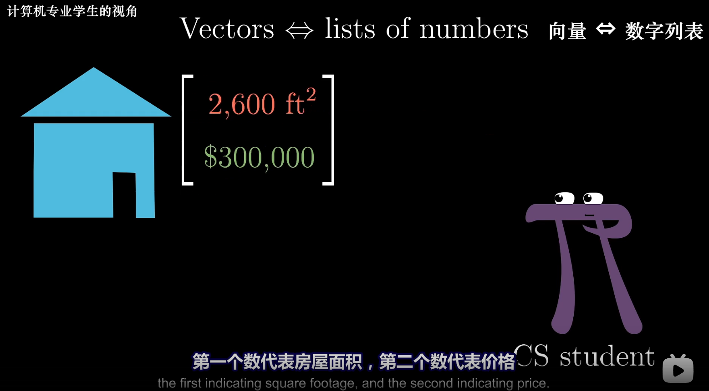

在数学中向量是以上两种解释的概括，在数学家的角度中向量可以表示为任何东西，只要保证向量**相加以及数字与向量的相乘是有意义**的即可

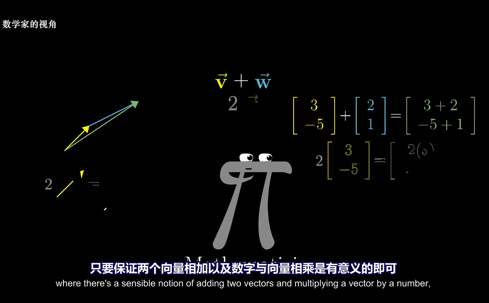

从这里可以看出对于向量来说**向量加法和向量数量贯穿线性代数始终**，二者起着很重要的作用

这个时候我们先停一下，我们先考虑一个箭头，考虑他处在一个x-y坐标系的内部，在线性代数中，所有的向量都是从原点出发，所以我们可以从坐标系中来理解向量是**有序的数字序列**这一观点

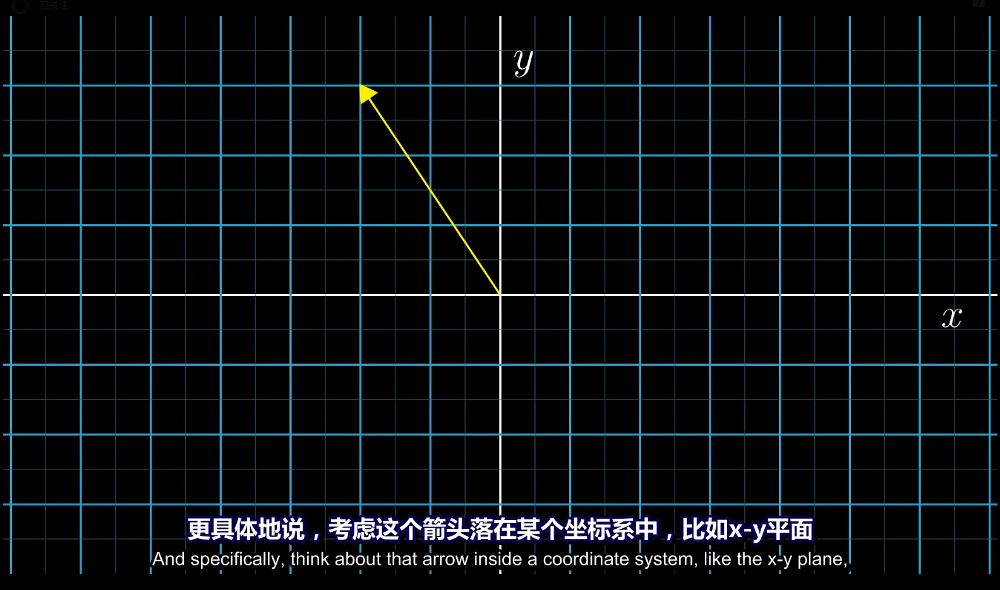

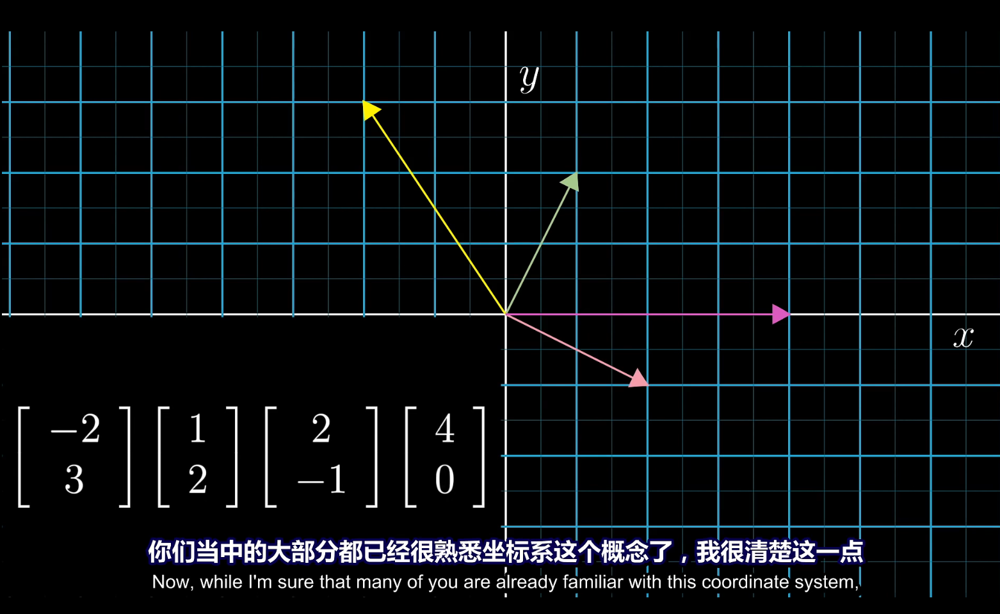

## 向量的计算

### 向量的加

给予两个向量，为了把他们相加，我们平移第二个向量，使他们的起点和第一个向量的终点重合，然后画出一个向量，它从第一个向量的起点出发，指向第二个向量的终点，这个新产生的向量就是他们的和。

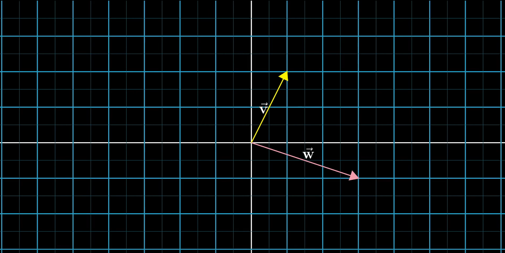

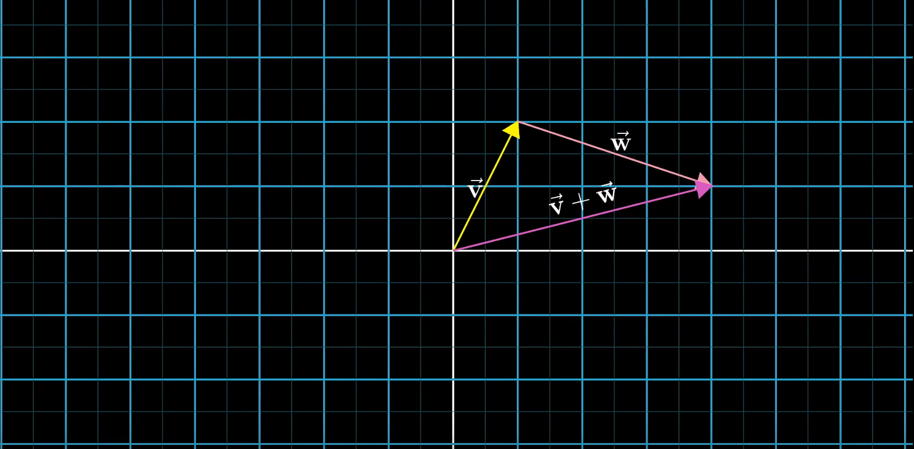

可以看出在我们创建的向量的终点，就是先从第一个向量走到终点，再从第一个向量的终点沿着第二个向量前进相同距离，所到达的终点，从数的角度上面看，就是

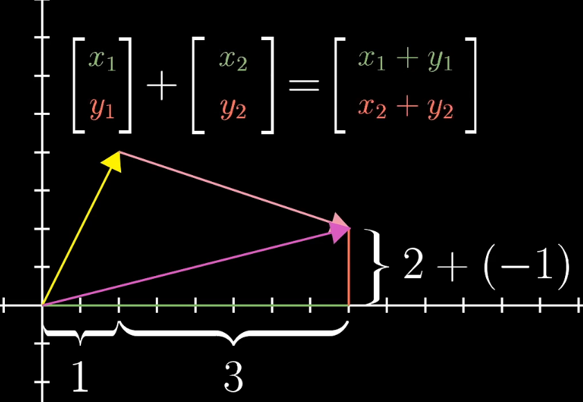

即在x轴上走了 *x1+x2* 步，在y轴上走了 *y1+y2* 步。

### 向量的乘

一个向量乘以一个常数，假设乘以2，那么就是意味着你把这个向量的长度拉长为原向量的两倍

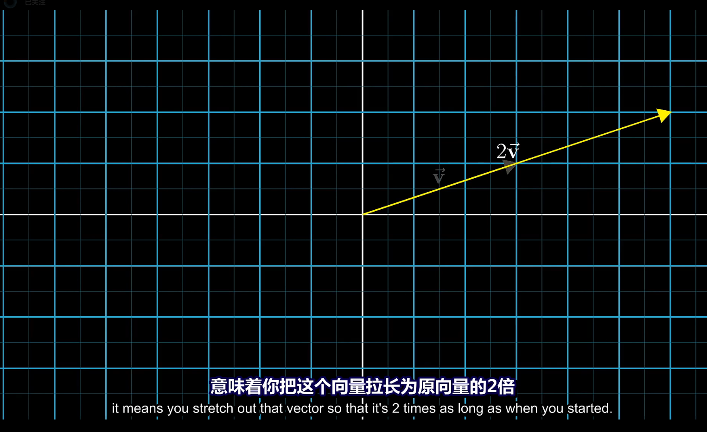

假设乘以1/3，那么意味着你把这个向量的长度缩短为原来的1/3

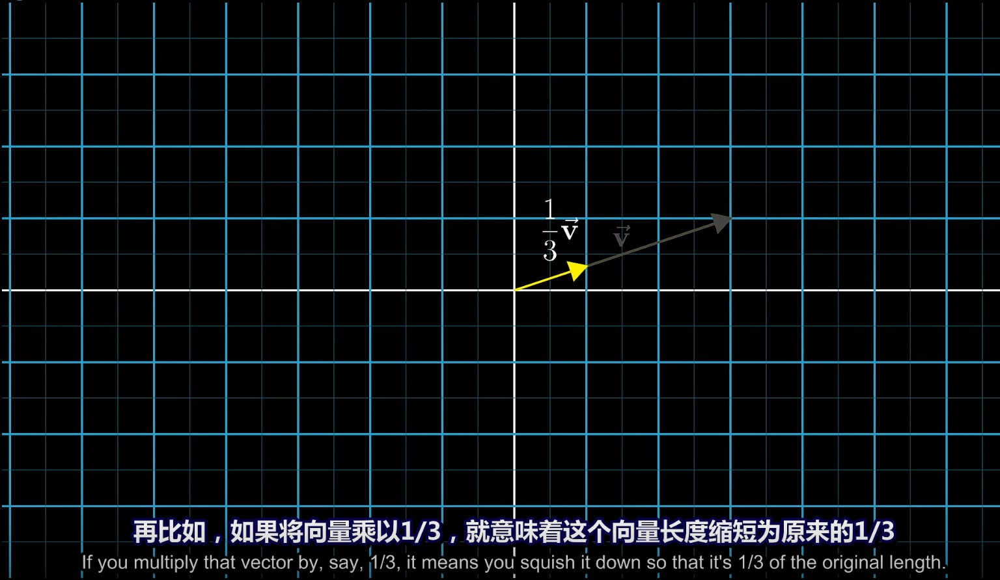

这种拉升或压缩，有时使向量反向的过程被称为**缩放**，而我们用来乘以向量的常数被我们称为**标量**

## 线性代数的意义
1. 为数据分析提供了列表概念化和可视化的方法

2. 看起来简洁易懂，也会帮助人理解某些特殊运算的意义。
3. 为物理学家和计算机图形程序员提供了一个更好的描述并操纵空间的形式。
